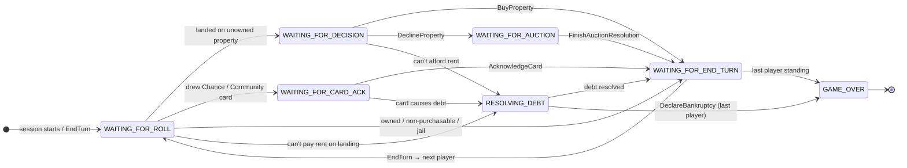
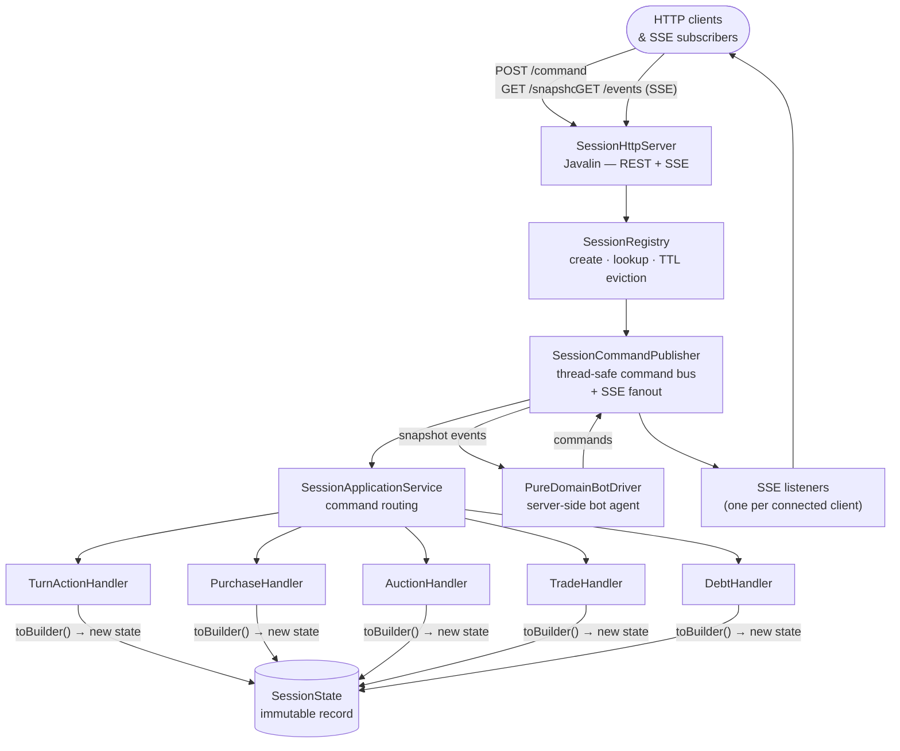

# MonopolyBackend

Standalone HTTP game server for a Finnish-rules Monopoly implementation.  
Clients (desktop or web) connect over HTTP and receive real-time state updates via Server-Sent Events (SSE).

---

## Table of contents

1. [Quick start](#quick-start)
2. [Build](#build)
3. [Run](#run)
4. [Configuration](#configuration)
5. [Session lifecycle](#session-lifecycle)
6. [HTTP API](#http-api)
   - [Health & meta](#health--meta)
   - [Session management](#session-management)
   - [Game commands](#game-commands)
   - [Snapshot polling](#snapshot-polling)
   - [SSE event stream](#sse-event-stream)
7. [Command reference](#command-reference)
8. [Bot players](#bot-players)
9. [Architecture overview](#architecture-overview)
10. [Testing](#testing)
11. [Deployment](#deployment)

---

## Quick start

```bash
# Build fat JAR
mvn clean package -DskipTests

# Start the server (port 10000 by default; use PORT=8080 to match the client's default)
PORT=8080 java -jar target/monopoly-backend.jar

# Create a 2-player session (one human, one bot)
curl -s -X POST http://localhost:8080/sessions \
  -H "Content-Type: application/json" \
  -d '{"names":["Jukka","Botti"],"colors":["#E63946","#2A9D8F"],"seatKinds":["HUMAN","BOT"]}' \
  | jq .
# → {"sessionId":"<uuid>"}

# Stream state updates
curl -N http://localhost:8080/sessions/<uuid>/events

# Roll the dice (first turn belongs to player-1)
curl -s -X POST http://localhost:8080/sessions/<uuid>/command \
  -H "Content-Type: application/json" \
  -d '{"type":"RollDice","sessionId":"<uuid>","actorPlayerId":"player-1"}'
```

The interactive API explorer (Swagger UI) is available at `http://localhost:8080/docs` once the server is running.

---

## Build

**Requirements:** Java 21, Maven 3.9+

```bash
# Compile and run all tests
mvn test

# Build deployable fat JAR (skipping tests)
mvn clean package -DskipTests

# Output: target/monopoly-backend.jar
```

---

## Run

### Directly from the fat JAR

```bash
java -jar target/monopoly-backend.jar
```

### With custom port and configuration

```bash
PORT=9090 java -Dmonopoly.session.ttl.minutes=60 \
               -Dmonopoly.bot.think.delay.ms=400 \
               -jar target/monopoly-backend.jar
```

### Docker

```bash
docker build -t monopoly-backend .
docker run -p 8080:8080 monopoly-backend
```

---

## Configuration

| Variable / Property | Default | Description |
|---|---|---|
| `PORT` (env var) | `10000` | HTTP server port (use `PORT=8080` locally to match the client's default `VITE_API_BASE`) |
| `-Dmonopoly.session.ttl.minutes` | `120` | Minutes of inactivity before a session is automatically evicted |
| `-Dmonopoly.bot.think.delay.ms` | `900` | Base think-time (ms) added to the situational delay before a bot acts |
| `-Dmonopoly.bot.initial.delay.ms` | `4000` | Grace period (ms) after session start before bots take their first action |
| `-Dmonopoly.localSavePath` | `saves/local-session.json` | Path used for local session persistence (single-session mode) |

Sessions are checked for idle eviction every 5 minutes. Activity is counted whenever a client fetches the snapshot or submits a command.

---

## Session lifecycle

### Direct start (bot/test sessions)

```
POST /sessions  { names, colors, seatKinds, difficulties }
      │
      ▼
  sessionId (UUID)   ← game starts immediately
      │
      ├── GET  /sessions/{id}/events    ← SSE stream — server pushes full snapshot on every accepted command
      ├── POST /sessions/{id}/command   ← submit game actions
      ├── GET  /sessions/{id}/snapshot  ← poll current state
      └── DELETE /sessions/{id}         ← remove session
```

### Lobby flow (human players)

```
POST /sessions  { lobbyMode: true, seatCount: N }
      │
      ▼
  { sessionId, hostToken, playerId, playerToken }
      │
      ├── POST /sessions/{id}/join               ← additional human players join
      ├── POST /sessions/{id}/lobby/bots         ← host adds a bot seat
      ├── DELETE /sessions/{id}/lobby/bots/{sid} ← host removes a bot seat
      └── POST /sessions/{id}/lobby/ready        ← player marks themselves ready
                                                    game starts when all humans are ready
```

1. **Create** — `POST /sessions` returns a UUID `sessionId`.
2. **Subscribe** — open `GET /sessions/{id}/events`. The server immediately pushes the current snapshot, then pushes again after every accepted command.
3. **Act** — submit commands via `POST /sessions/{id}/command`. The `actorPlayerId` must match the active player's turn.
4. **Poll** (optional) — `GET /sessions/{id}/snapshot` returns the current state without keeping a connection open.
5. **End** — the session is removed automatically after `monopoly.session.ttl.minutes` of inactivity, or explicitly via `DELETE /sessions/{id}`.

---

## HTTP API

All responses include CORS headers (`Access-Control-Allow-Origin: *`).  
`OPTIONS` preflight requests return HTTP 204.

### Health & meta

| Method | Path | Description |
|---|---|---|
| `GET` | `/health` | Liveness probe — returns `{"status":"ok"}` |
| `GET` | `/sessions` | List all active sessions |
| `GET` | `/openapi.yaml` | OpenAPI 3.1.0 specification |
| `GET` | `/docs` | Swagger UI |
| `GET` | `/metrics` | Session and command metrics |

### Session management

#### `POST /sessions` — Create a session

**Direct start** (all seats known up front):

```json
{
  "names":     ["Jukka", "Maria", "Botti"],
  "colors":    ["#E63946", "#2A9D8F", "#E9C46A"],
  "seatKinds": ["HUMAN", "HUMAN", "BOT"]
}
```

**Lobby mode** (human players join one by one):

```json
{
  "lobbyMode": true,
  "seatCount": 4,
  "hostName": "Jukka",
  "hostColor": "#E63946"
}
```

| Field | Required | Description |
|---|---|---|
| `names` | yes (direct) | 2–4 player display names |
| `colors` | no | CSS hex colours per seat; missing entries fall back to grey |
| `seatKinds` | no | `HUMAN` or `BOT` per seat; missing entries default to `HUMAN` |
| `lobbyMode` | no | `true` to enter lobby flow; game starts when all human seats mark ready |
| `seatCount` | no | Total seat count for lobby mode (2–4) |

All bots play at the same (strong) level — there is no difficulty field. The strategy preset is selected automatically based on player count (see [Bot players](#bot-players)).

Response `201` (direct start): `{ "sessionId": "..." }`  
Response `201` (lobby mode): `{ "sessionId": "...", "hostToken": "...", "playerId": "...", "playerToken": "..." }`

#### `GET /sessions` — List sessions

```json
[
  {
    "sessionId": "3fa85f64-5717-4562-b3fc-2c963f66afa6",
    "playerNames": ["Jukka", "Botti"],
    "status": "IN_PROGRESS"
  }
]
```

#### `DELETE /sessions/{id}` — Remove a session

Immediately removes the session regardless of game state. Returns HTTP 404 if not found.

#### Lobby endpoints

| Method | Path | Description |
|---|---|---|
| `POST` | `/sessions/{id}/join` | Human player joins a lobby session |
| `POST` | `/sessions/{id}/lobby/bots` | Host adds a bot seat (requires `hostToken`) |
| `DELETE` | `/sessions/{id}/lobby/bots/{seatId}` | Host removes a bot seat |
| `POST` | `/sessions/{id}/lobby/ready` | Player marks themselves ready; game auto-starts when all humans are ready |

#### Settings

| Method | Path | Description |
|---|---|---|
| `GET` | `/sessions/{id}/settings` | Get current session settings |
| `PUT` | `/sessions/{id}/settings` | Update settings — e.g. `{ "botSpeed": "fast" }` (`fast`, `normal`, `slow`) |

### Game commands

#### `POST /sessions/{sessionId}/command`

All commands share a `type` discriminator and `sessionId`. Most also require `actorPlayerId`.

**Accepted:**

```json
{ "accepted": true, "rejections": [] }
```

**Rejected (HTTP 422):**

```json
{
  "accepted": false,
  "rejections": [
    { "code": "NOT_YOUR_TURN", "message": "It is not player-2's turn" }
  ]
}
```

Common rejection codes: `NOT_YOUR_TURN`, `WRONG_PHASE`, `INSUFFICIENT_FUNDS`, `NOT_IN_JAIL`, `ALREADY_OWNER`, `DECISION_EXPIRED`.

### Snapshot polling

#### `GET /sessions/{sessionId}/snapshot`

Returns the full `ClientSessionSnapshot` as JSON. Useful for reconnecting clients or one-shot state reads.

Returns HTTP 404 if the session does not exist.

### SSE event stream

#### `GET /sessions/{sessionId}/events`

Opens a persistent `text/event-stream` connection.

- The server **immediately** sends the current snapshot as the first event.
- After every accepted command the server pushes a new snapshot.
- A `": heartbeat"` comment is sent every ~30 seconds to keep proxies alive.

Event format (one `data:` line, followed by a blank line):

```
data: {"sessionId":"...","version":5,"status":"IN_PROGRESS","viewAvailable":true,"state":{...}}

```

The `version` field is a monotonically increasing integer — clients can use it to detect missed events and decide whether to re-poll.

#### Snapshot structure

| Field | Type | Description |
|---|---|---|
| `sessionId` | string (UUID) | Session identifier |
| `version` | integer | Monotonically increasing state version |
| `status` | `IN_PROGRESS` \| `GAME_OVER` | Overall session status |
| `viewAvailable` | boolean | `true` when a game view is attached |
| `state` | `SessionState` | Full game state (see below) |

**`SessionState` top-level fields:**

| Field | Nullable | Description |
|---|---|---|
| `seats[]` | no | Seat metadata (seatId, playerId, kind, colour, displayName) |
| `players[]` | no | Per-player state (cash, boardIndex, properties, jail status) |
| `properties[]` | no | Per-property state (owner, mortgage, houses/hotel) |
| `turn` | no | Active player, phase, canRoll, canEndTurn, consecutiveDoubles |
| `pendingDecision` | yes | Active buy/decline decision (property purchase) |
| `auctionState` | yes | Active auction (bids, current actor, status) |
| `activeDebt` | yes | Active debt resolution state |
| `tradeState` | yes | Active trade negotiation |
| `winnerPlayerId` | yes | Set when `status` is `GAME_OVER` |
| `lastCardMessage` | yes | Text of the last Chance/Community Chest card drawn; cleared on `EndTurn` |

**Turn phases:**

| Phase | Meaning |
|---|---|
| `WAITING_FOR_ROLL` | Active player must roll (or use jail escape) |
| `WAITING_FOR_CARD_ACK` | Active player must acknowledge the drawn card |
| `WAITING_FOR_DECISION` | Active player must buy or decline the landed property |
| `WAITING_FOR_AUCTION` | Auction in progress — current bidder must bid or pass |
| `RESOLVING_DEBT` | Player owes money — must pay, mortgage, sell, or declare bankruptcy |
| `WAITING_FOR_END_TURN` | Player has acted; must call EndTurn to advance |
| `GAME_OVER` | Game has ended |



---

## Command reference

All commands require `type` (string discriminator) and `sessionId` (UUID).  
Commands marked with *actor* also require `actorPlayerId`.

### Turn flow

| Type | Actor | Extra fields | Valid phase |
|---|---|---|---|
| `RollDice` | yes | — | `WAITING_FOR_ROLL` |
| `EndTurn` | yes | — | `WAITING_FOR_END_TURN` |
| `AcknowledgeCard` | yes | — | `WAITING_FOR_CARD_ACK` |
| `UseGetOutOfJailCard` | yes | — | `WAITING_FOR_ROLL` (in jail, has card) |
| `PayJailFine` | yes | — | `WAITING_FOR_ROLL` (in jail, cash ≥ €50) |

### Property purchase

| Type | Actor | Extra fields | Valid phase |
|---|---|---|---|
| `BuyProperty` | yes | `decisionId`, `propertyId` | `WAITING_FOR_DECISION` |
| `DeclineProperty` | yes | `decisionId`, `propertyId` | `WAITING_FOR_DECISION` |

`decisionId` comes from `state.pendingDecision.decisionId`. Declining sends the property to auction.

### Auction

| Type | Actor | Extra fields | Valid phase |
|---|---|---|---|
| `PlaceAuctionBid` | yes | `auctionId`, `amount` | `WAITING_FOR_AUCTION` |
| `PassAuction` | yes | `auctionId` | `WAITING_FOR_AUCTION` |
| `FinishAuctionResolution` | no | `auctionId` | `WAITING_FOR_AUCTION` (status `RESOLVING`) |

`amount` must be ≥ `state.auctionState.minimumNextBid`.

### Debt resolution

| Type | Actor | Extra fields | Notes |
|---|---|---|---|
| `PayDebt` | yes | `debtId` | Requires cash ≥ debt |
| `MortgagePropertyForDebt` | yes | `debtId`, `propertyId` | Raises cash via mortgage |
| `SellBuildingForDebt` | yes | `debtId`, `propertyId`, `count` | Sells `count` buildings on property |
| `SellBuildingRoundsAcrossSetForDebt` | yes | `debtId`, `propertyId`, `rounds` | Sells one building per property in the colour group, `rounds` times |
| `DeclareBankruptcy` | yes | `debtId` | Eliminates player |

`debtId` comes from `state.activeDebt.debtId`.

### Buildings & mortgage

| Type | Actor | Extra fields | Notes |
|---|---|---|---|
| `BuyBuildingRound` | yes | `propertyId` | Buys one building on the target property (even-build rule enforced) |
| `SellBuildingRound` | yes | `propertyId` | Sells one building from the target property (even-sell rule enforced) |
| `ToggleMortgage` | yes | `propertyId` | Mortgages or lifts mortgage on one property |

Rules:
- **Even-build:** all properties in a colour group must stay within one building level of each other.
- **Bank supply:** the bank holds 32 houses and 12 hotels. Purchases are rejected when the bank runs out.
- **Mortgage:** only allowed in `WAITING_FOR_END_TURN` or `WAITING_FOR_DECISION` (mortgage only, not unmortgage, during decisions). Cannot mortgage if the colour group has buildings.
- **Unmortgage cost:** `mortgageValue × 1.1` (integer truncation), where `mortgageValue = listPrice / 2`.

### Trade

| Type | Actor | Extra fields | Notes |
|---|---|---|---|
| `OpenTrade` | yes | `recipientPlayerId` | Initiates trade negotiation |
| `EditTradeOffer` | yes | `tradeId`, `patch` | Partial update: `offeredCash`, `addPropertyId`, `removePropertyId` |
| `SubmitTradeOffer` | yes | `tradeId` | Sends offer to recipient |
| `AcceptTrade` | yes | `tradeId` | Executes the trade |
| `DeclineTrade` | yes | `tradeId` | Rejects and ends trade |
| `CounterTrade` | yes | `tradeId` | Sends back for re-editing |
| `CancelTrade` | yes | `tradeId` | Cancels before offer is submitted |

### Misc

| Type | Actor | Extra fields | Notes |
|---|---|---|---|
| `RefreshSessionView` | no | — | Triggers a snapshot push without changing state; useful after reconnecting |

### Trade — `EditTradeOffer` patch fields

| Field | Type | Description |
|---|---|---|
| `offeredSide` | boolean | `true` = edit proposer's side, `false` = edit request side |
| `propertyIdsToAdd` | string[] | Property IDs to add to the selected side |
| `propertyIdsToRemove` | string[] | Property IDs to remove from the selected side |
| `replaceMoneyAmount` | integer | Replace the money amount on the selected side |
| `toggleJailCard` | boolean | Toggle the Get-Out-of-Jail-Free card on the selected side |

---

## Bot players

Seats created with `seatKind: "BOT"` are controlled server-side by `PureDomainBotDriver`.  
The bot responds automatically after `monopoly.bot.think.delay.ms` milliseconds.

### Strategy presets

All bots play at the same (strong) level. The strategy is driven by `StrongBotConfig` —
a set of ~25 tunable weights (buy threshold, cash reserves, build aggression, auction
ceiling, trade fairness, …). A preset is selected automatically by player count:

| Players | Preset | Character |
|---|---|---|
| 2 | `aggressive()` | Builds fast, accepts thin cash positions, hotels welcome |
| 3 | `sixPlayer()` | Grabs almost everything, builds hard, trades for monopolies |
| 4–6 | `defaults()` | Balanced; tuned by evolutionary search over ~20 000 games |

Each additional bot seat in the same game receives a ±10 % parameter mutation
(`StrongBotConfig.forSeat`) so bots don't play identically.

### Tuning the bot

The presets are tuned with a headless tournament engine (`BotTournament`, test scope)
that plays thousands of games in seconds. The workflow lives in `BotEvolutionTest`
(all tests `@Disabled` — run manually):

```bash
# 1. Which parameters matter? (~4 min)
mvn test -Dtest=BotEvolutionTest#ablationStudy -Dsurefire.failIfNoSpecifiedTests=false

# 2. Evolutionary search for a better config (~30 min)
mvn test -Dtest=BotEvolutionTest#evolveSmallGame -Dsurefire.failIfNoSpecifiedTests=false

# 3. Verify across player counts, incl. robustness vs human-like play (~90 s)
mvn test -Dtest=BotEvolutionTest#quickBenchmark -Dsurefire.failIfNoSpecifiedTests=false
```

A `humanlike()` preset models a typical non-expert human player and is used to verify
the evolved configs don't overfit to bot-vs-bot patterns. After changing strategy code,
run `BotQualityRegressionTest` to confirm the preset ordering still holds.

### Bot speed

Bot action delays are multiplied by `SpeedMode.delayMultiplier`:

| Speed | Multiplier | Typical end-turn delay |
|---|---|---|
| `slow` (NORMAL) | 3.0× | ~450 ms |
| `fast` | 1.0× | ~150 ms |
| `instant` | 0.0× | 0 ms |

Change speed at runtime: `PUT /sessions/{id}/settings { "botSpeed": "fast" }`.

---

## Architecture overview



**Key design points:**

- `SessionState` is a Java 21 immutable record. Every command handler returns a new state rather than mutating in place.
- Commands flow through `SessionApplicationService`, which dispatches to a typed handler (e.g., `TurnActionCommandHandler`, `PropertyPurchaseCommandHandler`).
- `SessionCommandPublisher` serialises command handling and fans out snapshots to all registered SSE listeners after each accepted command.
- Bot drivers receive the same `ClientSessionSnapshot` that clients receive and submit commands via the same `SessionCommandPublisher`.

### Package layout

```
fi.monopoly
├── server/
│   ├── BackendMain.java              ← entry point
│   ├── transport/SessionHttpServer   ← HTTP routes, SSE streaming
│   └── session/
│       ├── SessionRegistry           ← session store + TTL eviction
│       ├── SessionCommandPublisher   ← command bus + listener registry
│       └── PureDomainBotDriver       ← server-side bot agent
├── application/
│   ├── session/
│   │   ├── SessionApplicationService ← command routing
│   │   └── turn/                     ← command handlers & gateways
│   └── command/                      ← command record types
├── domain/
│   └── session/
│       ├── SessionState              ← authoritative immutable game state
│       ├── TurnState, SeatState …    ← nested state records
│       └── SpotType, SeatKind …      ← domain enums
├── client/session/
│   ├── ClientSessionSnapshot         ← SSE/HTTP payload
│   └── ClientSessionListener         ← callback interface for state updates
└── infrastructure/
    └── persistence/                  ← optional JSON save/load
```

---

## Testing

```bash
# Run all tests
mvn test

# Run a single test class
mvn test -Dtest=TurnActionCommandHandlerTest

# Run a single test method
mvn test -Dtest=TurnActionCommandHandlerTest#rejectRollWhenNotYourTurn
```

Test types:

- **Command handler unit tests** (`TurnActionCommandHandlerTest`, `AuctionCommandHandlerTest`, etc.) — validate game-rule enforcement in isolation using a fake gateway.
- **Integration / smoke tests** (`SessionRegistryTest`, SSE transport tests) — verify end-to-end HTTP and SSE behaviour with a real in-process server.
- **Frontend rule tests** — the React client (`monopoly-client`) has a Vitest-based integration suite under `e2e/rules/` that exercises game rules end-to-end against a running backend instance.

---

## Deployment

A `Dockerfile` and a `render.yaml` (for [Render](https://render.com)) are included in the repository root.

### Render (cloud)

1. Push the repository to GitHub.
2. Create a new **Web Service** on Render pointing at the repo.
3. Build command: `mvn clean package -DskipTests`
4. Start command: `java -jar target/monopoly-backend.jar`
5. Set the `PORT` environment variable if you need a non-default port (Render injects it automatically).

The deployed instance serves the live client at https://jukkakot.github.io/monopoly-client/ from `https://monopoly-backend-bv41.onrender.com`.

### Environment variables summary

| Variable | Default | Notes |
|---|---|---|
| `PORT` | `10000` | Injected automatically by most PaaS platforms |
| `monopoly.session.ttl.minutes` | `120` | Pass as `-D` JVM flag |
| `monopoly.bot.think.delay.ms` | `900` | Pass as `-D` JVM flag |
