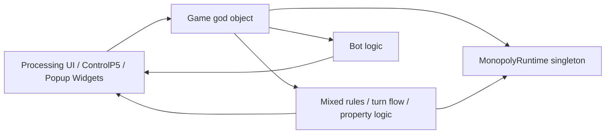
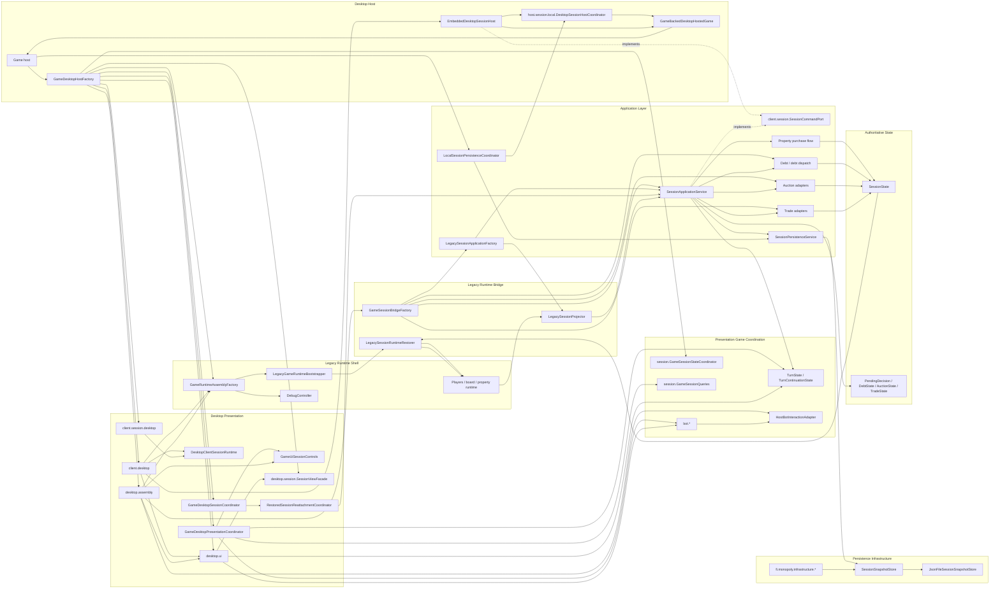
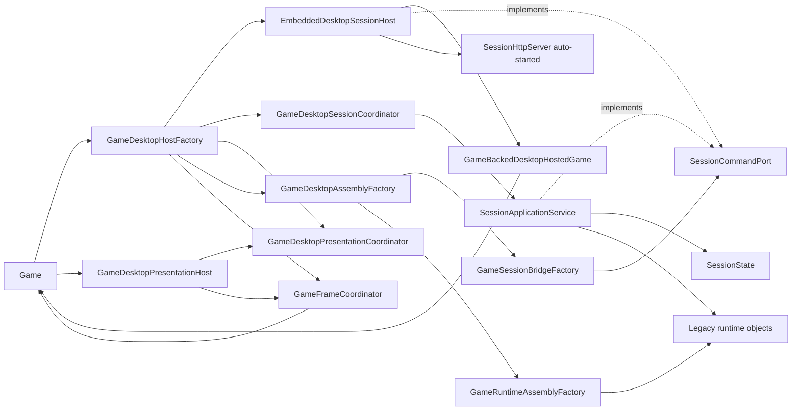
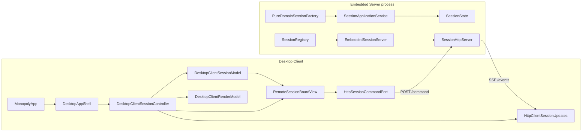
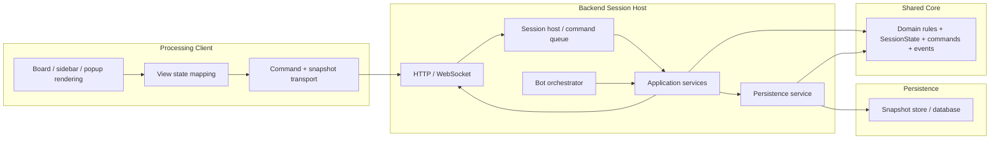
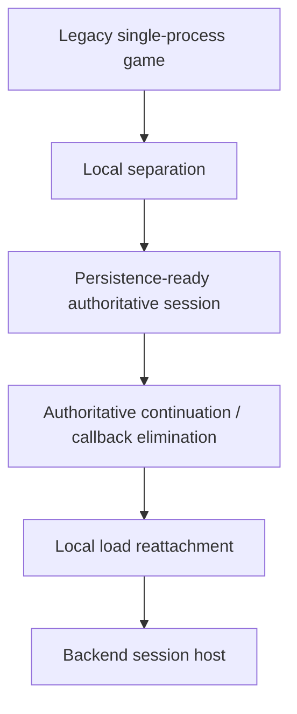

# Architecture Overview Diagrams

## Purpose

This file is the fast visual companion to the longer architecture docs.

Use it when you want a quick answer to:

- what the current app architecture roughly looks like
- what the current local-first separated shape looks like
- what the intended backend-ready target shape looks like

The diagrams are intentionally high-level. They are not a class diagram and they do not try to show every adapter.

## 1. Before Separation

This is the legacy shape the project started from conceptually.

What this means:

- the UI, orchestration, and rule authority were too mixed together
- popup flow was often effectively gameplay flow
- bot execution depended too much on client/runtime assumptions

## 2. Current Structure In This Repo

This is the rough shape now after the local separation work currently implemented.

What is important here:

- `Game` is now more clearly a desktop host/compatibility surface, not the only place where wiring lives
- desktop code is explicitly split into `client.desktop`, `assembly`, `shell`, `runtime`, `session`, and `ui`
- turn flow, bot flow, and desktop session state are now separated into `turn`, `bot`, and `session` packages
- local save/load still works through a narrow `SessionHost` seam instead of direct rebuild callbacks
- authoritative state still lives in `SessionState` and related domain records, not only in live UI/runtime objects
- the Processing entry app and runtime now both live under `client.desktop`, so the root package no longer owns desktop bootstrap/runtime classes
- desktop-only global flags such as debug mode and skip-animations now live in explicit `client.desktop` settings/state helpers instead of `MonopolyApp`
- client-owned save/load trigger callbacks now also live under `client.session.desktop` instead of the presentation-session package
- the Processing app shell now talks to a single `DesktopClientSessionRuntime` port instead of directly forwarding embedded-session shell methods one by one
- the old generic `ClientSession` type is gone; the client now depends on an explicit `ClientSessionUpdates` gateway for session-update subscriptions, while host-side restore authority stays behind `SessionHost`
- `ClientSessionUpdates` also no longer exposes a direct snapshot getter; embedded local mode now publishes snapshot state through listener updates only
- embedded desktop frame advancement no longer lives on the client session-update gateway; the Processing runtime now gets that local-only behavior through a separate desktop frame-driver seam
- `ClientSessionUpdates` is now closer to a pure client state/view subscription seam, while fresh-session and local persistence workflows go through a separate desktop-local controls port
- embedded live render access also no longer lives on the session-update gateway; desktop mode reaches it through a dedicated local view port
- the live render view type itself no longer sits in the transport-neutral client-session package; it now lives under the desktop-local session package
- the desktop app shell now owns a small `DesktopClientSessionModel` fed by `ClientSessionUpdates` listener updates, so raw snapshot/listener pass-through no longer lives on `DesktopClientSessionRuntime`
- the desktop app shell now also owns a small `DesktopClientRenderModel`, so `DesktopClientSessionRuntime` no longer exposes raw `currentView()` polling either
- `DesktopAppShell` now also receives one bundled client-host binding and narrow `DesktopRuntimeAccess` port instead of constructing the embedded local host shell/bootstrap graph itself
- pause, bot-speed, language, and local save/load UI actions now also cross into desktop presentation through a dedicated `GameUiSessionControls` port instead of the broad `GamePresentationFactory.Hooks` surface
- desktop control-layer and font resources are also isolated behind `client.desktop` runtime resource helpers instead of hanging off `MonopolyApp`
- shared rendering helpers now depend on a small `client.desktop` rendering context seam instead of the full `MonopolyApp` type
- frame/layout/session orchestration code now reads time and viewport state through `MonopolyRuntime` helpers instead of reaching directly into Processing app fields
- desktop app-shell runtime/persistence adapters now receive the active runtime instance explicitly from `DesktopRuntimeBridge` instead of calling the global runtime singleton directly
- embedded-local bootstrapping now also lives behind an explicit `EmbeddedLocalDesktopClientBindingFactory`, which is closer to the future point where embedded and remote client bindings can be swapped
- the Processing input observer now also pulls its event bus through `DesktopAppShell` instead of reaching for a global runtime singleton
- the Processing app constructor no longer creates a placeholder runtime singleton before real desktop bootstrap happens
- shared utility helpers no longer rely on a global current-app context at all; rendering callers pass an explicit rendering context
- property-level runtime checks for building supply and utility rent now also resolve through the owning player's runtime/session context instead of the global runtime singleton
- projected desktop session views now read popup state through explicit collaborators instead of depending on the full runtime shell
- the remaining `Game` host constructor is now driven through an explicit desktop bootstrap factory instead of assembling controls, shell, and presentation inline
- embedded desktop session hosting now targets a small hosted-game interface instead of depending on the full `Game` host type for normal session/view lifecycle operations
- app-shell and embedded-client test-only hosted-game access is now isolated behind an explicit `testAccess()` seam instead of living on the normal production shell API
- concrete local hosted-game creation now also lives behind an assembly-side factory seam, so the client-desktop runtime bridge no longer constructs `Game` directly
- embedded local session lifecycle, persistence, and snapshot publication now live on the host side, and the embedded host now exposes the client-session seam directly instead of routing through `LocalDesktopClientSession`
- the embedded host now also reaches the concrete game through a dedicated `DesktopHostedGame` adapter instead of using `Game` itself as the hosted-session contract
- integration and smoke tests now increasingly inspect `Game` through one explicit test facade instead of reaching into scattered private host internals
- the local hosted-game lifecycle/view/test-access seams now also live under `host.session.local` instead of the presentation package tree
- the hosted-game seam is now split between host-owned frame advancement and a narrower client-facing render view, so bot/session ticking no longer shares the same interface surface as drawing
- embedded local mode now also runs bot stepping from an explicit host-owned game loop coordinator instead of from the presentation frame coordinator itself
- desktop-local popup, trade, and projected-view dependencies now cross into `host.bot` through a single `HostBotInteractionAdapter` seam
- bot turn contexts now build projected views for the actual acting player, which is important when debt resolution is driven by someone other than the nominal current turn owner
- `SessionCommandPort` in `client.session` is now the transport-neutral command submission and state query seam: `handle(SessionCommand)` + `currentState()` — any future remote host transport adapter only needs to implement these two methods
- `SessionApplicationService` now implements `SessionCommandPort`, so the embedded local mode works without behavioral change while the seam is ready for a remote backend
- `EmbeddedDesktopSessionHost` now also implements `SessionCommandPort` and acts as the single named command entry point on the host side, so command submission and snapshot publication both flow through it
- `HostedLocalSession` extends `SessionCommandPort`, making it a requirement for all future local host implementations
- the five presentation-layer session adapters (debt, auction, purchase, trade) now depend only on `SessionCommandPort` instead of the full `SessionApplicationService` — any future transport adapter automatically satisfies their constructor requirement
- `ForwardingSessionCommandPort` introduced in `client.session`: a mutable proxy that routes `handle()` calls through `EmbeddedDesktopSessionHost` (wired at session start) while always returning locally-projected state from `currentState()`; this makes the host the single command entry point without creating circular state query chains
- all five presentation-layer adapters now receive the `ForwardingSessionCommandPort` proxy; their command submissions route through `EmbeddedDesktopSessionHost.handle()` which publishes a snapshot directly after each accepted command
- `SessionApplicationService.postCommandListener` / `setPostCommandListener()` removed — snapshot publication is now the host's direct responsibility, not an application-service side effect
- `DesktopHostedGame.setExternalCommandDelegate()` replaced `setPostCommandListener()` — the host wires the proxy delegate to itself immediately after game creation
- `BotTurnScheduler` no longer imports `DesktopClientSettings` directly; the `skipAnimations` flag is now injected as a `BooleanSupplier`, removing the desktop-specific global dependency from the `host.bot` layer
- `SessionBackedComputerTurnContext` and `GameBotTurnHooksAdapter` both now depend on `SessionCommandPort` instead of `SessionApplicationService` — bot command submissions go through the same transport-neutral interface as human player commands; the specialized `handleComputerAuctionAction` is injected as a `Function<String, CommandResult>` lambda
- `GameDesktopShellDependencies.sessionCommandPort()` now exposes the narrower `SessionCommandPort` type alongside `sessionApplicationService()`, and the two bot coordinator hooks for active auction/trade state use it instead of the full service wrapper methods
- `GameSessionStateCoordinator.onDebtStateChanged()` no longer takes `SessionApplicationService`; the `clearDebtOverride` behavior is now passed as a `Runnable` callback, removing the application-service dependency from the presentation-session coordinator
- the legacy bridge is still present because the Processing desktop client still runs on legacy runtime objects
- `OverlaySessionStateStore` in `application.session` now holds the five mutable flow-state
  fields (auction, debt, trade, pending decision, turn continuation) that previously lived
  as instance variables on `SessionApplicationService`; `currentState()` is now a plain
  `overlay.get()` call — turn phase derivation and stale pending-decision clearing happen inside
  the store's `get()` method
- the main remaining monolith is the `Game` host itself, which now delegates more but still exposes many compatibility hooks for tests and the current desktop client
- **HTTP-backed remote session mode** (`-Dmonopoly.mode=remote`): `HttpBackedDesktopClientBindingFactory` starts an `EmbeddedSessionServer` (pure-domain, no legacy runtime), creates a session via `SessionRegistry`, and wires `RemoteSessionBoardView` — a new Processing renderer that draws the board and sidebar entirely from `SessionState` snapshots received over SSE; commands flow back via `HttpSessionCommandPort`; the legacy `Game`/`Players`/`TurnEngine` graph is not instantiated at all in this mode; local mode unchanged with auto-started HTTP server always exposed on a free port
- **`PureDomainBotDriver`** (server.session): event-driven server-side bot scheduler for pure-domain sessions; registered as `ClientSessionListener` on `SessionCommandPublisher`; when a snapshot arrives and the active actor is a BOT seat, schedules a greedy command after a 600 ms think delay via `ScheduledExecutorService`; same greedy strategy as `PureDomainGameSimulationTest` (roll → buy if affordable → decline → end turn; debt: pay/mortgage/bankruptcy; auction: bid minimum or pass); `SessionRegistry.create()` auto-starts the driver when any seat is `SeatKind.BOT`; `HttpBackedDesktopClientBindingFactory` marks the second player as BOT so "Botti" takes turns automatically in remote mode

## 3. Current Practical Runtime Shape

There are now two supported runtime shapes depending on the `-Dmonopoly.mode` JVM flag.

### 3a. Local Mode (default — `-Dmonopoly.mode=local`)

In local mode, the embedded HTTP server is always auto-started on an auto-detected port (override with `-Dmonopoly.http.port=<port>`). This exposes the running game session over HTTP for external clients and dev tools (`devclient.html`).

### 3b. Remote Mode (`-Dmonopoly.mode=remote`)

In remote mode:

- an `EmbeddedSessionServer` starts in-process on a free port and creates a pure-domain session via `PureDomainSessionFactory`
- `RemoteSessionBoardView` renders the 11×11 board and sidebar directly from `SessionState` snapshots — no legacy `Game`/`Players` objects involved
- action buttons (Roll Dice, End Turn, Buy Property, etc.) dispatch commands via `HttpSessionCommandPort`
- `HttpClientSessionUpdates` consumes SSE from `/sessions/{id}/events` and updates `DesktopClientSessionModel`
- the Processing frame loop calls `RemoteSessionBoardView.draw()` each frame; `mousePressed()` forwards to `RemoteSessionBoardView.handleMousePressed()`

This is already much closer to backend-safe behavior than the original project shape, but not fully backend-clean yet in local mode because:

- the desktop client still owns the authoritative application service instance locally
- the bridge still mutates legacy runtime objects in-process
- the desktop client now has its own listener-fed session and render models, but the rendered live view is still host-provided rather than a transport-neutral client projection
- `Game` still exposes a broad compatibility surface for tests and local desktop orchestration, even though frame and session-view work now sits behind `GameDesktopPresentationHost`

## 4. Current Package View

This is the shortest package-oriented map of the current gameplay presentation structure.

```mermaid
flowchart TD
    ROOT[presentation.game]
    CLIENTROOT[client]
    HOSTROOT[host.session.local]
    ROOT --> BOT[bot]
    ROOT --> SESSION[session]
    ROOT --> TURN[turn]
    ROOT --> DESKTOP[desktop]
    CLIENTROOT --> CLIENTDESKTOP[desktop]
    CLIENTROOT --> CLIENTSESSION[session]

    DESKTOP --> ASSEMBLY[assembly]
    DESKTOP --> SHELL[shell]
    DESKTOP --> RUNTIME[runtime]
    DESKTOP --> DESKTOPSESSION[session]
    DESKTOP --> UI[ui]

    CLIENTSESSION --> CMDPORT[SessionCommandPort]
    CLIENTSESSION --> CLIENTUPDATES[ClientSessionUpdates]
    CLIENTSESSION --> SNAPSHOT[ClientSessionSnapshot]

    HOSTROOT --> EMBHOST[EmbeddedDesktopSessionHost]
    HOSTROOT --> HOSTEDLOCAL[HostedLocalSession]

    SERVERROOT[server.transport]
    SERVERROOT --> CMDMAPPER[SessionCommandMapper]
    SERVERROOT --> HTTPSERVER[SessionHttpServer]
    HTTPSERVER -.->|wraps| CMDPORT

    SERVERSESSION[server.session]
    SERVERSESSION --> SESSIONSERVER[SessionServer]
    SERVERSESSION --> PUBLISHER[SessionCommandPublisher]
    SERVERSESSION --> STARTSERVER[StartSessionServer]
    SERVERSESSION --> REGISTRY[SessionRegistry]
    SERVERSESSION --> EMBSRV[EmbeddedSessionServer]
    SERVERSESSION --> BOTDRIVER[PureDomainBotDriver]
    BOTDRIVER -.->|implements| CLIENTUPDATES
    REGISTRY --> BOTDRIVER
    SESSIONSERVER --> HTTPSERVER
    PUBLISHER -.->|implements| CMDPORT
    PUBLISHER -.->|implements| CLIENTUPDATES

    PRESENTREMOTE[presentation.remote]
    PRESENTREMOTE --> BOARDVIEW[RemoteSessionBoardView]
    PRESENTREMOTE --> MOUSEVIEW[MouseInteractiveView]
    PRESENTREMOTE --> KEYVIEW[KeyboardInteractiveView]
    PRESENTREMOTE --> SETUPVIEW[RemotePlayerSetupView]
    BOARDVIEW -.->|implements| MOUSEVIEW
    SETUPVIEW -.->|implements| MOUSEVIEW
    SETUPVIEW -.->|implements| KEYVIEW

    CLIENTDESKTOP --> BINDINGFACTORY[DesktopClientHostBindingFactory]
    BINDINGFACTORY --> LOCALFACTORY[EmbeddedLocalDesktopClientBindingFactory]
    BINDINGFACTORY --> REMOTEFACTORY[HttpBackedDesktopClientBindingFactory]
    REMOTEFACTORY --> EMBSRV
    REMOTEFACTORY --> BOARDVIEW
```

Useful mental model:

- `bot`: bot scheduling and bot turn stepping
- `session`: desktop session state/presentation coordination
- `turn`: actual turn flow orchestration
- `client.desktop`: Processing app-facing shell and runtime adapters; `selectBindingFactory()` picks `EmbeddedLocalDesktopClientBindingFactory` (default) or `HttpBackedDesktopClientBindingFactory` (remote mode) based on `-Dmonopoly.mode`
- `client.session`: transport-neutral seam types — `SessionCommandPort` (send commands), `ClientSessionUpdates` (receive snapshots), `ClientSessionSnapshot` (snapshot payload)
- `desktop.assembly`: object graph construction
- `desktop.shell`: orchestration between host and extracted coordinators
- `desktop.runtime`: legacy runtime bootstrap and lifecycle
- `desktop.session`: session bridge and restored-session reattachment
- `desktop.ui`: controls, layout, frame rendering, input binding, and the extracted desktop presentation host
- `host.session.local`: `EmbeddedDesktopSessionHost` (single command entry point + snapshot publisher) and `HostedLocalSession` (combines all local host seams)
- `server.transport`: `SessionCommandMapper` (JSON ↔ `SessionCommand`), `SessionHttpServer` (multi-session endpoints: `POST /sessions`, `GET /sessions`, `POST /sessions/{id}/command`, `GET /sessions/{id}/snapshot`, `GET /sessions/{id}/events`, `GET /health`); auto-started in local mode
- `server.session`: `SessionServer` (lifecycle wrapper), `SessionCommandPublisher` (snapshot-publishing decorator), `StartSessionServer` (standalone main), `SessionRegistry` (thread-safe multi-session registry; auto-starts `PureDomainBotDriver` for BOT seats), `EmbeddedSessionServer` (lifecycle wrapper used by remote mode binding factory), `PureDomainBotDriver` (event-driven greedy bot — runs on the server side, drives BOT seats in pure-domain sessions without legacy Processing runtime)
- `presentation.remote`: `RemoteSessionBoardView` (Processing renderer driven entirely from `SessionState` snapshots — no legacy Game/Players), `MouseInteractiveView` (optional interface for click handling)

## 5. Target Backend-Ready Architecture

This is the intended future shape after the remaining local cleanup and server extraction.

What changes at that point:

- the server owns authoritative state
- bots run on the server
- the client only sends commands and renders approved state
- save/load and reconnect semantics are the same system, not separate systems

## 6. Migration Summary

Current practical status:

- `A -> B` is largely done
- `C`, `D`, and `E` are now substantially in place
- the client-facing backend contract is now fully defined: `SessionCommandPort` (commands in), `ClientSessionUpdates` (snapshots out), `ClientSessionSnapshot` (transport-neutral payload carrying the full `SessionState`) — all in `client.session`
- `ClientSessionSnapshot` now carries the complete authoritative `SessionState`, making snapshots self-sufficient: a client can reconstruct its presentation model from the snapshot without a separate state query to the host
- `EmbeddedDesktopSessionHost` now implements `SessionCommandPort` and is the single named command entry point for the embedded local host — a remote transport adapter needs only to implement the same two-method interface
- the five presentation-layer adapters (debt, auction, purchase, trade) already depend only on `SessionCommandPort`, so they are ready to be rewired to either an embedded or remote host without behavioral change
- the remaining local cleanup means: (1) moving adapter assembly out of `Game` and into host-level wiring so adapters receive `EmbeddedDesktopSessionHost` directly, (2) separating legacy runtime reconstruction from authoritative session execution
- `F` is the next major architecture milestone, with the main prerequisite being a concrete server-side session host that implements the already-defined `SessionCommandPort` + `ClientSessionUpdates` contract
- **`server.transport` package now exists** with `SessionCommandMapper` (JSON ↔ `SessionCommand`) and `SessionHttpServer` (`POST /command`, `GET /snapshot`, `GET /events` SSE, `GET /health`); the embedded host is optionally exposed over HTTP via `-Dmonopoly.http.port=<port>`
- **`server.session` package now exists** with `SessionServer` (lifecycle wrapper), `SessionCommandPublisher` (snapshot-publishing decorator over any `SessionCommandPort` + `ClientSessionUpdates`), and `StartSessionServer` (standalone server main — **fully functional, no Processing runtime required**); tested end-to-end with `StartSessionServerIntegrationTest`
- **`PureDomainSessionFactory`** wires all six gateway interfaces with pure domain implementations — no legacy runtime objects:
  - `DomainAuctionGateway`, `DomainPropertyPurchaseGateway`, `DomainTurnActionGateway` (dice rolling, movement, GO bonus, GO_TO_JAIL, rent, tax, jail, building purchase, mortgage, **Chance/Community card effects**), `DomainTurnContinuationGateway`, `DomainDebtRemediationGateway` (pay/mortgage/sell/bankruptcy), `DomainTradeGateway` (validate + apply trade offers)
  - `initialGameState(sessionId, playerNames, colors)` creates a ready-to-play `SessionState` (all properties unowned, €1500 per player, shuffled Chance/Community decks via `CardDeckLoader`)
  - `SessionState` carries per-session `chanceDeck`/`communityDeck` (`List<String>`) — card draw rotates the drawn card to the deck bottom
  - `TurnState` gained `consecutiveDoubles` for re-roll tracking
- **`domain.decision.DecisionPayload`** sealed interface with `@JsonTypeInfo`/`@JsonSubTypes` ensures `PendingDecision.payload` survives HTTP JSON round-trips without transport-layer MixIns
- project now runs on **Java 21**: `SessionHttpServer` uses `Executors.newVirtualThreadPerTaskExecutor()`, SSE reader and shutdown hook use `Thread.ofVirtual()`, `SessionCommandSerializer` and `InteractiveTurnEffectExecutor` use Java 21 pattern-matching switch
- **`fi.monopoly.application` layer is now clean** — no `fi.monopoly.components.*` imports remain in any application-layer class; legacy-specific code moved to `presentation.legacy`:
  - `DebtOpeningGateway` and `RentAndDebtOpeningHandler` moved to `presentation.legacy.session.debt`
  - `LegacySessionPaymentPort` (new) implements `SessionPaymentPort` via `RentAndDebtOpeningHandler`; wired in `GameSessionBridgeFactory`
  - `SessionPaymentPort` moved to `client.session` (alongside `SessionCommandPort`)
  - `PropertyPurchaseCommandHandler.isAlreadyOwned()` now uses `SessionState.properties()` (pure domain) instead of legacy `PropertyFactory` FQCN
- **Pure domain game simulation** (`PureDomainGameSimulationTest`): greedy-agent simulation drives complete 2- and 4-player games through all phases (roll, buy, auction, debt/mortgage/bankruptcy) without any Processing runtime; detects deadlocks via consecutive-rejection counting; 560 tests green
- **`StartingOrderDeterminer`** extracted to `application.session`: shared utility for 2d6 dice-roll starting-order resolution with recursive tie-breaking; `PureDomainSessionFactory.determineStartOrder()` now delegates to it; `GameRuntimeAssemblyFactory` calls it after `setupDefaultGameState()` so the legacy desktop path now also applies the standard Finnish Monopoly starting-order rule
- **Sidebar rendering from snapshot (first steps)**: `FrameHooks.authoritativeSessionState()` wired from `SessionCommandPort.currentState()`; `GameSidebarStateFactory` now reads turn phase from `SessionState.turn().phase()` when available (falls back to boolean heuristics); spot name and computer-player badge also derived from `PlayerSnapshot.boardIndex` and `SeatState.seatKind` respectively — the sidebar header now renders from the authoritative domain snapshot rather than legacy `Player` object fields
- **Player objects removed from remaining hook interfaces**: `GamePresentationFactory.Hooks.currentTurnPlayer()` replaced with `boolean isCurrentPlayerComputerControlled()`; `GameSessionStateCoordinator.declareWinner(Player)` replaced with `declareWinner(String winnerPlayerId, String winnerName)` — winner name now resolved from `SessionState.seats.displayName()` at the hook boundary; `GameSessionState.winner` (Player field) removed — winner identity stored as `winnerPlayerId`/`winnerName` strings; restored game sessions now also restore `winnerName` from seats; `Game.declareWinner(Player)` removed as dead code
- **`LegacyTurnActionGatewayAdapter`**: `Supplier<Player> turnPlayerSupplier` replaced with `BooleanSupplier hasActiveTurn` — `endTurn()` now checks `getTurn() != null` without exposing Player to the gateway
- **`GameDesktopShellDependencies`**: `playerByIdResolver` removed from `StateAccess`; `focusPlayer(Player)` replaced with `focusPlayerById(String playerId)` — player lookup and coord reset moved into `Game.focusPlayerById()` implementation; `GameDesktopPresentationCoordinator.focusWinner()` simplified; `focusDebtDebtor()` uses player ID from legacy `PaymentRequest.debtor().getId()`
- **`RestoredLegacySessionRuntime`**: `playersById` map field removed — callers use `Players.getPlayers()` stream lookup by numeric ID
- **`GameDesktopShellDependencies.StateAccess`**: `Supplier<Player> currentTurnPlayerSupplier` replaced with `BooleanSupplier hasActiveTurnSupplier` + `BooleanSupplier isComputerTurnSupplier`; `currentTurnPlayer()` method removed; `hasActiveTurn()` + `isComputerTurn()` added; `GameDesktopHostFactory.Hooks` now exposes `hasActiveTurnSupplier()`, `isComputerTurnSupplier()`, and `turnPlayerNameSupplier()` instead of `currentTurnPlayerSupplier()`; `Game.java` wires three lambdas from `players.getTurn()`; `GameDesktopPresentationCoordinator.hasActivePlayer()` / `isCurrentPlayerComputer()` now use `deps.hasActiveTurn()` / `deps.isComputerTurn()`
- **`HostBotInteractionAdapter`**: `acceptActivePopupFor(Player)` / `declineActivePopupFor(Player)` renamed to `acceptActivePopup()` / `declineActivePopup()` — Player param was unused in the desktop implementation
- **`GameBotTurnDriver.Hooks`**: `currentTurnPlayer()` removed — `resolveActingPlayer()` and `handleAuctionStep()` now resolve the active player via `findPlayerById(sessionState.turn().activePlayerId())`; `resolveVisiblePopupFor(Player)` → `resolveVisiblePopupFor(ComputerPlayerProfile)` in the driver hooks and `GameBotTurnHooksAdapter`; `turnPlayerSupplier` field and lambda removed from `GameBotTurnHooksAdapter` and `GamePresentationFactory`
- **View factory chain depersonalised**: `HostBotInteractionAdapter.currentGameView/currentPlayerView` now take `String playerId`; `GameDesktopHostFactory.Hooks`, `GameDesktopShellDependencies.ProjectionAccess`, `GamePresentationFactory.Hooks`, `DesktopHostBotInteractionAdapter` updated; `Game.java` adds `createGameViewById/createPlayerViewById` with internal player stream lookup; `Player` import removed from `GameDesktopHostFactory` and `GameDesktopShellDependencies`

Remote mode player setup + bot difficulty (sessions 18–19):
- **`RemotePlayerSetupView`** (`presentation.remote`): pre-game setup screen shared by both remote and local modes; player count (2–4), editable name text fields (keyboard: backspace/enter/esc/printable chars), Human/Bot toggles, color swatches (6 presets, cycles on click for human slots), difficulty toggle (Helppo/Norm.) for bot slots; calls `onStart` callback with `PlayerSetupConfig(names, colorHexes, seatKinds, difficulties)` when "Aloita peli" is clicked
- **`KeyboardInteractiveView`** (`presentation.remote`): optional marker interface; `MonopolyApp.keyPressed()` override routes keyboard events to the current view if it implements this interface
- **`BotDifficulty` enum** (`domain.session`): `NORMAL` (greedy strategy) and `EASY` (40% skip purchases, 50% pass auctions via `ThreadLocalRandom`)
- **`PureDomainBotDriver`**: now carries `Map<String playerId, BotDifficulty> difficulties`; EASY mode skips `handleDecision` 40% of the time and passes auctions 50% of the time; `createAndRegisterIfNeeded(publisher, sessionId, botPlayerIds, difficulties)` factory overload added; bug fixed: old `handleDebt()` SELL_BUILDING branch returned unconditionally (missing explicit `if (buildingProp.isPresent())`) so MORTGAGE_PROPERTY was never reached when no building was found
- **`SessionRegistry.create(names, colors, seatKinds, difficulties)`**: new overload; `buildDifficultyMap()` helper maps seat-index position to player ID → `BotDifficulty` from the initial session state; existing 3-arg overload delegates to new one with empty difficulty list
- **`EmbeddedSessionServer.create(names, colors, seatKinds, difficulties)`**: new overload; existing 3-arg overload delegates to new one
- **`HttpBackedDesktopClientBindingFactory`**: shows `RemotePlayerSetupView` first via `SwitchableViewPort` inner class; `launchSession()` creates `EmbeddedSessionServer` + session with chosen config (including difficulties) on "Aloita peli" click; server lifecycle tracked via `AtomicReference<EmbeddedSessionServer>` shutdown hook
- **`EmbeddedLocalDesktopClientBindingFactory`**: also shows `RemotePlayerSetupView` first; `DeferredLocalSessionControls` blocks `startFreshSession()` until "Aloita peli" clicked; `applyLocalConfig()` maps `SeatKind` → `monopoly.players`/`monopoly.profiles` system properties; `AtomicBoolean setupDone` controls view switching between setup screen and game view
- **`UiTokens`**: 5 new setup-screen layout constants (`SETUP_CARD_WIDTH`, `SETUP_SLOT_HEIGHT`, `SETUP_NAME_FIELD_WIDTH`, `SETUP_TOGGLE_WIDTH`, `SETUP_COLOR_SWATCH_SIZE`) with public accessor methods
- **`RemoteSessionBoardView`** improvements: management buttons (`addManagementButtons()`) now use `propertyDisplayName()` — localized names from `SpotType.getStringProperty("name")` with enum name fallback — instead of `shortLabel()`; debt buttons (mortgage-for-debt, sell-building) also use `propertyDisplayName()`; build buttons restricted to `completedColorGroups()` only (full Monopoly color group owned); mortgage/redeem list capped at 6 to prevent sidebar overflow; `PackageType4.remote` diagram updated to include `KeyboardInteractiveView` and `RemotePlayerSetupView` nodes
- **`PureDomainBotDriver.tryBuildGreedy()`** (session 20): NORMAL bot builds houses during `WAITING_FOR_END_TURN` — iterates complete unmortgaged color groups, picks property at minimum house count (even-building rule), dispatches `BuyBuildingRoundCommand` if cash ≥ `housePrice`; EASY bots skip building entirely and always end turn; 2 new `PureDomainBotDriverTest` cases added
- **`PureDomainBotDriver.tryUnmortgageGreedy()`** (session 21): NORMAL bot unmortgages before building — picks cheapest mortgaged property in a group the bot fully owns, dispatches `ToggleMortgageCommand` if `cash - unmortgageCost >= MIN_CASH_RESERVE (200€)`; `botOwnsFullGroup()` helper (counts ALL properties in group including mortgaged); `unmortgageCost()` = `price/2 + 10%`; EASY bots skip unmortgaging entirely; 2 new tests added (`normalBotUnmortgagesWhenOwnsFullGroupAndHasCash`, `normalBotDoesNotUnmortgageWithInsufficientReserve`)
- **`PureDomainBotDriver.handleDebt()` even-selling fix** (session 21): SELL_BUILDING branch now uses `evenSellEligible()` helper (mirrors `DomainDebtRemediationGateway.canSellBuildings`: `level >= maxRest`) + `max(buildingLevel)` selection — picks eligible property with most buildings; `PureDomainGameSimulationTest` fixed with same logic; `MAX_STEPS` raised 2000→4000
- **`RemoteSessionBoardView`** mortgage/build buttons also shown during `WAITING_FOR_ROLL` (session 21) — domain doesn't block these commands before rolling; `addManagementButtons()` call added to the roll-phase branch
- **HTTP integration tests for build/mortgage** (session 22): `SessionRegistryHttpIntegrationTest` now has 14 tests — added `toggleMortgageCommandRejectedForUnownedProperty`, `buyBuildingRoundCommandRejectedForUnownedProperty`, `unknownCommandTypeReturns400`; confirm deserialisation wiring and graceful 422 rejection
- **`PureDomainBotDriverTest` even-selling test** (session 22): `debtHandlerSellsBuildingFromEligiblePropertyUnderEvenSellingRule` — B1=1 house, B2=2 houses; verifies bot targets B2 and never B1; 8 bot driver tests total; 570 tests green
- **Mortgage validation fixes** (session 22, continued): `TurnActionCommandHandler.handleToggleMortgage()` now rejects mortgage attempts on street properties when any property in the color group still has buildings (`BUILDINGS_PRESENT` rejection); `RemoteSessionBoardView.addManagementButtons()` hides mortgage button for such properties (calls `canMortgageInDebt()` helper); `debtorUnmortgagedProperties` in debt phase also applies same filter; `evenSellEligible()` helper added to filter sell-building buttons in debt phase to only show eligible properties; `TurnActionCommandHandlerTest`: 10 tests (was 9); 572 tests green
- **Bot driver auction-winner stall fix** (session 22): `PureDomainBotDriver.resolveActorId()` now returns `winningPlayerId` when `AuctionStatus.WON_PENDING_RESOLUTION` — previously returned `null` (currentActorPlayerId is null in that state), causing `needsBotAction()` to return false and leaving fully-bot sessions stuck waiting for `FinishAuctionResolutionCommand`; new test: `botAuctionWinnerDispatchesFinishResolutionCommand`; 9 bot driver tests, 572 total
